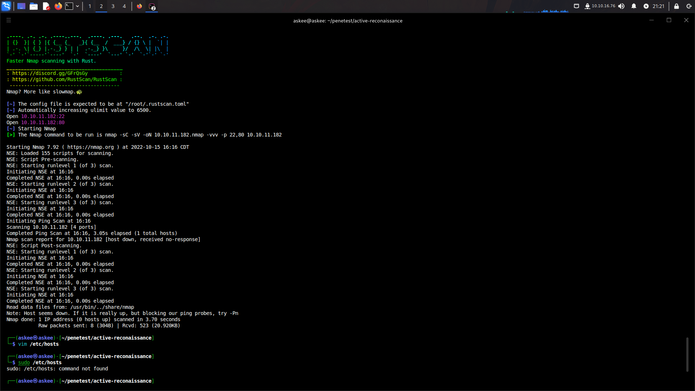
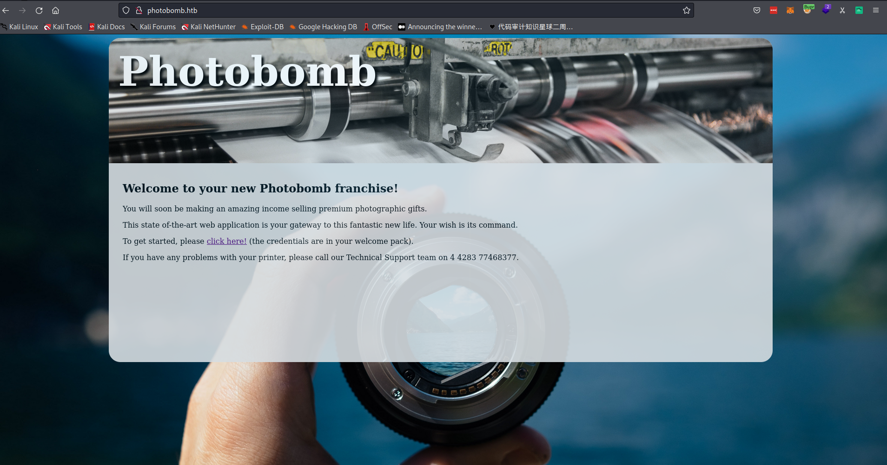
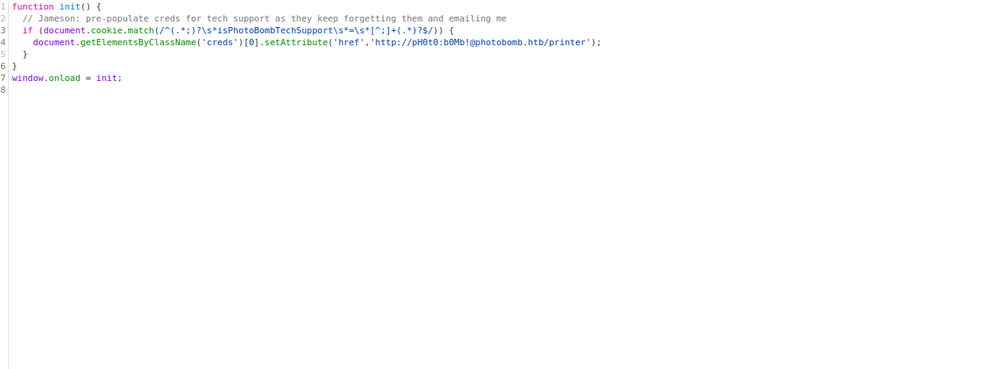
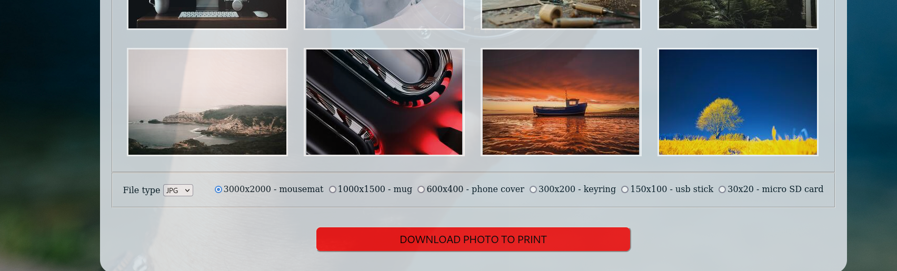
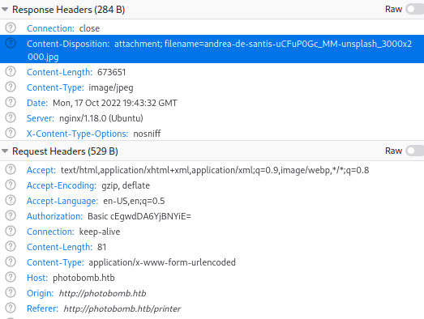
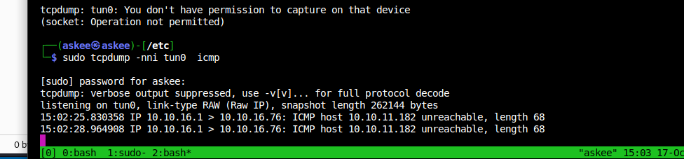
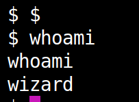
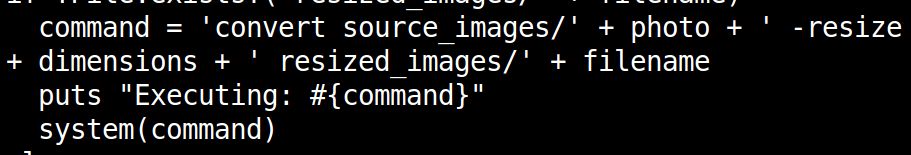
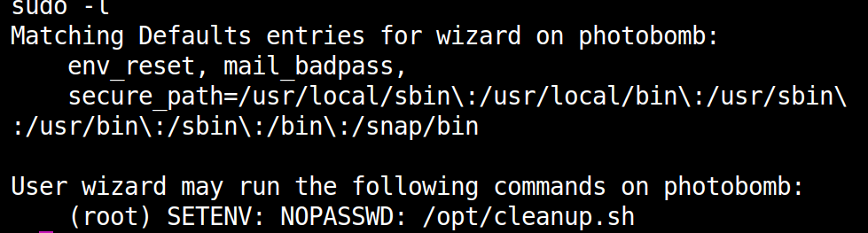
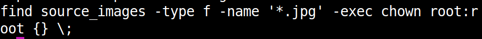

# Photobomb

## Basic Enumeration



So as we can see we have:
`port 80` open which points to a webpage.

`port 22` which is ssh available.

> If it didn't work for you make sure to add the following lines to `/etc/hosts`:
```bash
MACHINE_IP_ADDRESS www.photobomb.htb
MACHINE-IP_ADDRESS photobomb.htb
```

So I tried to see if there is a web server hosted on `port 80` but it gave me the following
  

Okay let's do what we are good at, some basic Web enumerations:

- [x]  Nothing in HTML
- [x]  Something interesting in `photobomb.js`

  

Okay so now we can visit as logged in user.
  

As we can see there is the following functionality available:

1. Pick a picture.
   - No LFI found. Knowing the pictures paths gave me no insight other than the folder name `ui_images`
2. Choose the type in which we want the picture in.
   - Some image conversion is happening somewhere. I don't think there is a tool that integrates with the API. **There might be some command call here !**
3. Pick the size of the final picture.
   - The picture is clearly getting resized. I thought here about imagemagick as it's popular tool for image manipulation.
4. Download it.
   - The generated picture is dropped somewhere and we get it back. Can we control where is it dropped to do something malicious ? I will return to it later. Let me analyze the server response first.

  

Honestly at this point I wrote the following lines in .txt file and called `dict.txt`. Run my intruder to iterate through the 3 paramaters

```txt
; whoami 
 ; id ;#
&& whoami
; echo "Hi there" ;#"
##
```

  

> I felt lucky here, As we can the see my input was reflected in the attachement and we got an error that means the execution of the command had failed but is it really executing the `whoami`.I needed to confirm that.

I tried to ping my machine and felt like a boss seeing this:
  

So we can craft a reverse shell:

- I tried the bash one and it didn't work then I kept trying till I decided to go for a python shell. Honestly, I feel I am missing something. There should be a hint somewhere that python is installed.

  

- The server was `ruby` and here is the vulnerable code.
  

`sudo -l`
  

  
Seeing the `cleanup.sh` script we see that it's vulnerable to $PATH manipulation. We can create a malicious find and we add it's path to the $PATH env variable.

user.txt a60e74e325521fde7c17ba47d76637cd
root.txt b716765843847441a03600dd05303753

===
~ Finished 10/14/22
