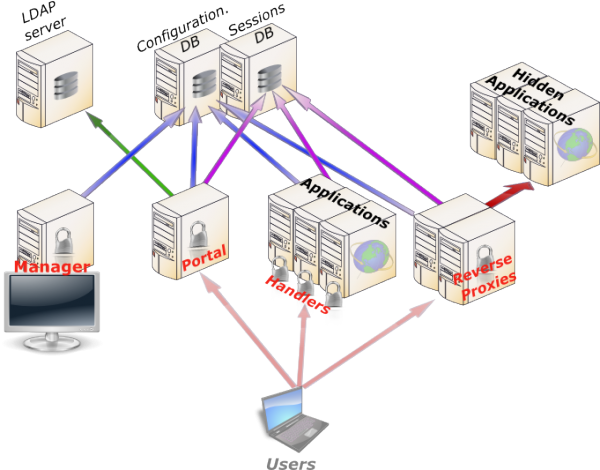

Presentation
============

LemonLDAP::NG is a modular WebSSO (Single Sign On) based on
Apache::Session modules. It simplifies the build of a protected area
with a few changes in the application.

It manages both authentication and authorization and provides headers
for accounting. So you can have a full AAA protection for your web space
as described below.

Architecture
------------

|image0|

Main components
~~~~~~~~~~~~~~~

-  **Manager**: used to manage LemonLDAP::NG configuration and to
   explore sessions. Dedicated to administrators
-  :doc:`Portal<portal>`: used to authenticate
   users, display applications list and provides identity provider
   service (`SAML <http://en.wikipedia.org/wiki/SAML>`__,
   `OpenID <http://en.wikipedia.org/wiki/OpenID>`__,
   `CAS <http://en.wikipedia.org/wiki/Central_Authentication_Service>`__).
   Futhermore, Portal affordes many other features (see
   :doc:`portal<portal>` for more)
-  :doc:`Handler<index_handler>`: used to protect applications which can read HTTP headers
   or environment variables to get user information

Databases
~~~~~~~~~

.. attention::

    We call "database" a backend where we can read or write a data.
    This can be a file, an LDAP directory, etc...

We split databases in two categories:

-  **External databases**: not managed by LemonLDAP::NG, for example
   user database
-  **Internal databases**: only used by LemonLDAP::NG

Main
:ref:`external databases<start-authentication-users-and-password-databases>`
are:

-  **Authentication**: how authenticate users
-  **User**: where collect user data
-  **Password**: where change the password

Main internal databases are:

-  :ref:`Configuration<start-configuration-database>`:
   where configuration is stored. This does not include web server
   configuration which is not managed by LemonLDAP::NG
-  :ref:`Sessions<start-sessions-database>`:
   where sessions are stored.
-  :doc:`Notifications<notifications>`:
   messages displayed to connected users
-  **Cache**: cache for configuration and sessions

.. _presentation-kinematics:

Kinematics
----------

.. _presentation-login:

Login
~~~~~

|image1|

#. User tries to access a protected application, his request is caught by Handler
#. :doc:`SSO cookie<ssocookie>` is not detected, so Handler redirects user to Portal
#. User authenticates on Portal
#. Portal checks authentication
#. If authentication succeeds, Portal collects user data
#. Portal creates a session to store user data
#. Portal gets the session Id
#. Portal creates :doc:`SSO cookie<ssocookie>` with the session Id as value
#. User is redirected on protected application, with a SSO cookie
#. Handler reads session Id from the cookie and retrieves user session data
#. Handler stores user data in its cache
#. Handler checks access rules and sends headers to the protected application
#. Protected application sends response to Handler
#. Handler forwards the response to the user

Then handler will check :doc:`SSO cookies<ssocookie>` for each HTTP request.

Logout
~~~~~~

Default use case:

#. User clicks on the logout link in Portal
#. Portal destroys session and redirects user on itself with an empty
   :doc:`SSO cookies<ssocookie>`
#. User is redirected on portal and his :doc:`SSO cookies<ssocookie>` is empty

LemonLDAP::NG is also able to
:doc:`catch logout request<writingrulesand_headers>`
on protected applications, with different behavior:

-  **SSO logout**: the request is not forwarded to application, only the
   SSO session is closed
-  **Application logout**: the request is forwarded to application but
   SSO session is not closed
-  **SSO and Application logout**: the request is forwarded to
   application and SSO session is closed

After logout process, the user is redirected on portal, or on a configured URL.

Session expiration
~~~~~~~~~~~~~~~~~~

The session expires after 20 hours by default.
This duration can be set in the manager's Configuration tab (General Parameters > Sessions > Sessions Timeout).

.. attention::

    -  Handlers have a session cache, with a default lifetime of 10 minutes.
       So for Handlers located on different physical servers than the Portal, a user
       with an expired session can still be authorized until the cache expires.
    -  Sessions are deleted by a scheduled task. Don't forget to install cron files!

.. _cda:

Cross Domain Authentication (CDA)
~~~~~~~~~~~~~~~~~~~~~~~~~~~~~~~~~

.. note::

    For security reason, a cookie provided for a domain cannot be sent
    to another domain. To extend SSO on several domains, a cross-domain
    mechanism is implemented in LemonLDAP::NG.

#. User owns
   :doc:`SSO cookies<ssocookie>` on the
   main domain (see :ref:`Login kinematics<presentation-login>`)
#. User tries to access a protected application in a different domain
#. Handler does not see
   :doc:`SSO cookies<ssocookie>`
   (because it is not in main domain) and redirects user on Portal
#. Portal recognizes the user with its
   :doc:`SSO cookies<ssocookie>`, and
   see he is coming from a different domain
#. Portal redirects user on protected application with a token as URL
   parameter. The token is linked to a session which contains the real
   session ID
#. Handler detects URL parameter, gets the real session ID, delete the
   token session and creates a
   :doc:`SSO cookies<ssocookie>` on its
   domain, with session ID as value

Authentication, Authorization and Accounting (AAA) mechanisms
-------------------------------------------------------------

Authentication
~~~~~~~~~~~~~~

If a user is not authenticated and attempts to connect to an area
protected by a LemonLDAP::NG compatible Handler, he is redirected to a
portal.

Authentication process main steps are:

-  **Control asked URL**: prevent XSS attacks and bad redirections
-  **Control existing session**: detect SSO session, apply configured
   constraints (1 session per user, 1 session per IP, ...)
-  **Extract form info**: get login/password, certificate, environment
   variable (depending on authentication module)
-  **Get user info**: contact user database to collect attributes
-  **Ask for second factor if required**: TOTP, U2F key, etc...
-  **Set macros**: compute configured macros
-  **Set groups**: request user database to find groups
-  **Set local groups**: compute configured groups
-  **Authenticate**: contact authentication database to check
   credentials
-  **Grant session**: check rights to open SSO session
-  **Store**: store user info in session database
-  **Build cookie**: build
   :doc:`SSO cookies<ssocookie>` with
   session ID
-  **Redirect**: redirect user on protected application or on Portal
   (applications menu)

LemonLDAP::NG
:doc:`SSO cookies<ssocookie>` are
generated by
`Apache::Session <http://search.cpan.org/perldoc?Apache::Session>`__,
they are as secure as a 128-bit random cookie. You may use the
:doc:`securedCookie<ssocookie>` options
to avoid session hijacking. (since version 1.4.0 you can use SHA256 for
generating safer cookies)

Authorization
~~~~~~~~~~~~~

Authorization is controlled only by Handlers. An authorization is
defined by:

-  An URL pattern (or ``default`` to match other URLs)
-  An access rule

.. note::

    Authorizations are defined inside a virtualhost and takes effect
    only on it. There are no *global* authorizations except the right to
    open a session in the portal.

Access rules values can be:

-  ``accept``: all authenticated users can pass
-  ``deny``: nobody is welcomed
-  ``skip``: all is open!
-  ``unprotect``: all is open, but authenticated users are seen as
   authenticated
-  ``logout_sso``, ``logout_app``, ``logout_app_sso``: catch logout
   request
-  Perl expression: perl code snippet that returns 0 or 1

Some examples:

-  Accept all authenticated users:

   -  URL pattern: ``default``
   -  Access rule: ``accept``

-  Restrict /admin to administrators group

   -  URL pattern: ``^/admin/``
   -  Access rule: ``$groups =~ /\badministrators\b/``

.. tip::

    \ ``\b`` means start or end of a word in PCRE (Perl Compatible
    Regular Expressions)

See
:doc:`Writing rules and headers<writingrulesand_headers>`
chapter.

Accounting
~~~~~~~~~~

Logging portal access
^^^^^^^^^^^^^^^^^^^^^

Portal produce a ``notice`` message in
:doc:`Web server logs or syslog<logs>` when a user
authenticates (or fails to authenticate) and logs out.

Logging application access
^^^^^^^^^^^^^^^^^^^^^^^^^^

Handler informs Web server of connected user (parameter
``whatToTrace``), so you can see user login in Web server access logs.

The real accounting has to be done by the application itself since SSO
logs can not understand transactions.

LemonLDAP::NG can export
:ref:`HTTP headers<headers>`
either using a proxy or protecting directly the application.

An HTTP header is defined by:

-  A name
-  A value

.. note::

    Headers are defined inside a virtualhost and take effect only on
    it. There are no *global* headers.

The header value is a Perl expression, returning a string.

Some examples:

-  Send login in Auth-User:

   -  Name: ``Auth-User``
   -  Value: ``$uid``

-  Send "Lastname, firstname" in Auth-Name:

   -  Name: ``Auth-Name``
   -  Value: ``$sn + ", " + $gn``

See
:doc:`Writing rules and headers<writingrulesand_headers>`
for more.

