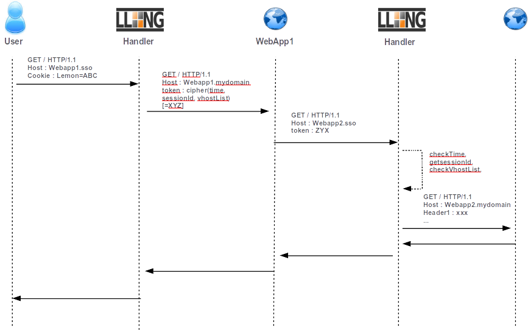

Handling server webservice calls
================================

In modern applications, web application may need to request some other
web applications on behalf of the authenticated users. There are three
ways to do this:

-  the Ugly: provide to all applications SSO cookie. Not secured
   because SSO cookie can be caught and used everywhere, every time by
   everyone!!! **NOT RECOMMENDED**.
-  the Bad (:doc:`Secure Token Handler<securetoken>`): **Deprecated**.
   Should be used for specific cases
-  the Good (Service Token Handler): See below! (Thanks Sergio...)

The "Bad" method consists to give the token (cookie value) to WebApp1
which uses it as cookie header in its request. Since 2.0 version, LL::NG
gives a better way (the Good!) to do this by using limited scope
tokens.

Tokens are time limited (30 seconds by default) and URL restricted.

|Kinematic|

Webapp1 handler configuration
-----------------------------

Select **Main** handler type to protect WebApp1 and append a header containing:

.. code-block:: perl

   token( $_session_id, 'webapp2.example.com', 'webapp3.example.com', 'serviceHeader1=webapp1.example.com', "testHeader=$uid" )

WebApp1 can read this header and use it in its requests by setting the
``X-LLNG-TOKEN`` header. The token is built by using the ``token`` extended
with session ID and authorized virtualhosts list parameters. A Service Token is valide
for the specified virtual hosts only and during 30 seconds by default. It can also be
used for sending service headers (headerName1=headerValue1) to requested
apps. Can be useful to send the origin host by example. Service headers are
sent to ALL requested applications.

You can set Service Token TTL by editing virtualHost options in Manager
for each requested virtualHost.

You can also set ServiceToken default timeout (30 seconds) by editing
``lemonldap-ng.ini`` in section [handler]:

.. code-block:: ini

   [handler]
   handlerServiceTokenTTL = 30

.. note::

    Service token timeout can be set for each virtual hosts.

Webapp2 handler configuration
-----------------------------

Change handler type to **ServiceToken**. So it is able to manage both
user and server connections. And that's all!

